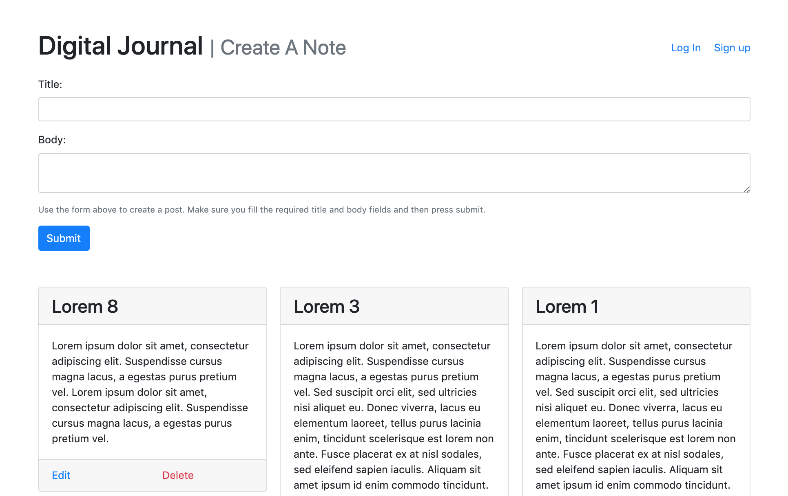
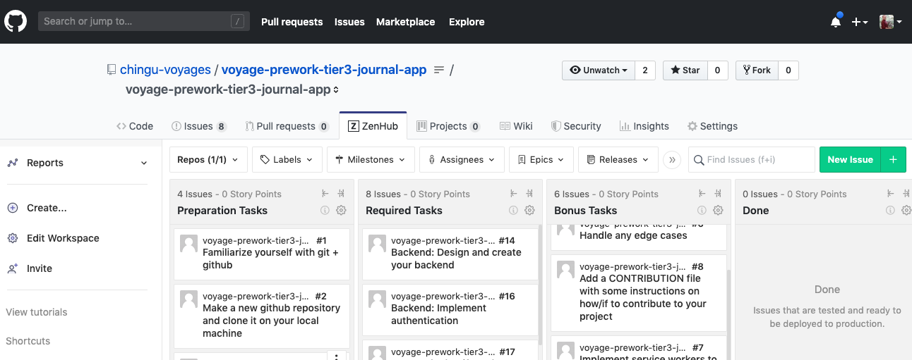

# Chingu Voyage Pre-work Project (Tier 3): Journal App

## Overview
This project helps you gain experience using authentication techniques to 
protect your app and users against unauthorized access. Your objective in this 
project is to build a web application that allows users to register, login,
and maintain personal notes. 

## Instructions

General instructions for all Pre-Work Projects are located in the Chingu 
Voyage Handbook (URL posted in the `#read-me-first` channel on Discord). 
For detailed requirements checkout the ZenHub Board that is part of this repo.

To see the ZenHub tab on the GitHub repo webpage requires that you install ZenHub's browser extension. For more
information visit the [ZenHub Browser Extension page](https://www.zenhub.com/extension) and these [installation instructions](https://t.ly/3v8w).

If you would like to add these tasks to your repo so you can track the progress of your Solo Project and so they will be 
more readily available for reference you will need to manually add new issues to your ZenHub board and copy/paste the text
in our issues to yours.

Good Luck!!!
